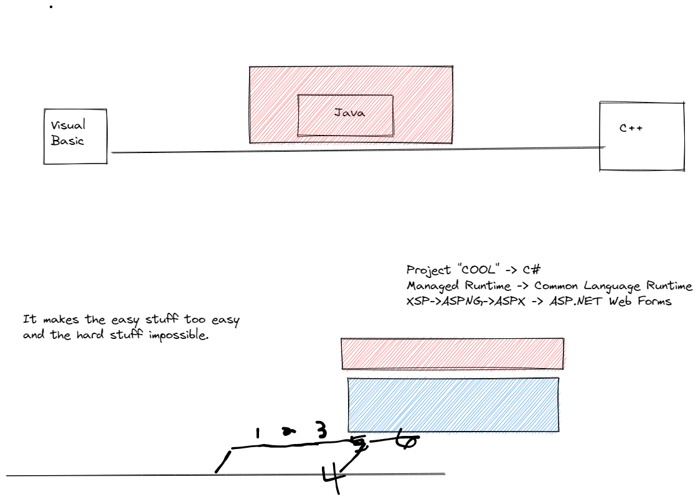

# .NET
## History

## Key Components

1. Common Language Runtime
    - Like the "Java Virtual Machine"
    - A program that runs on a computer that knows how to run .NET applications.
    - .NET applications are compiled to `IL` Code. (Intermediate language), which is sort of like Java Byte Code. Not quite compiled all the way. Half baked.
    - The CLR compiles the code the rest of the way using a JIT Compiler (Just-in-Time).
2. Common Type System
    - Freedom to use whatever language you want, as long as it compiles to IL code.
3. Languages
    - the choice of languages, we will use C#.

When you compile a .NET application, you create an *Assembly*.
An assembly contains you compiled IL code and a "database" of all the types in that assembly.

